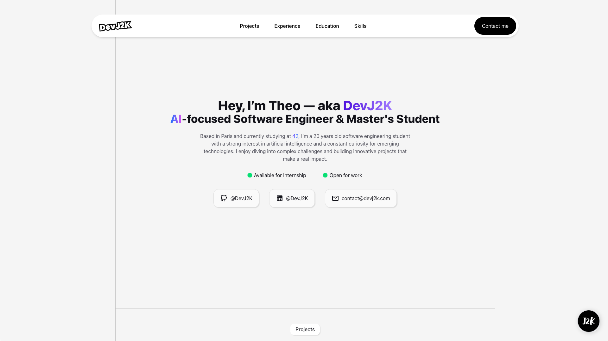
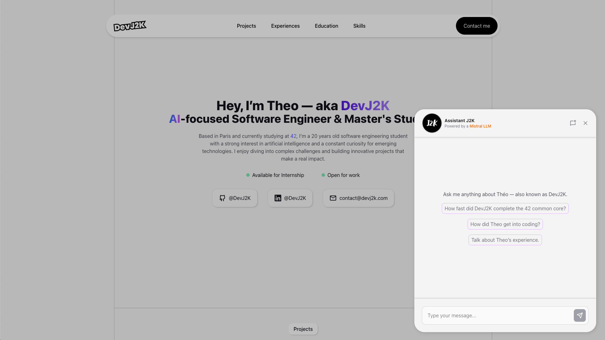

# DevJ2K - Portfolio 🧑‍💻

This is the code repository for my personal portfolio website, [devj2k.com](https://devj2k.com). It showcases my projects, skills, and experiences in the field of software development.

> **Note**
>
> It was built first time with `Nuxt`[(see nuxt version)](https://github.com/DevJ2K/portfolio_v2/tree/main/frontend-nuxt) then migrated to `Next.js`[(see next version)](https://github.com/DevJ2K/portfolio_v2/tree/main/frontend-next) for frontend. The backend is powered by the python framework `FastAPI` and uses Mistral's models for AI functionalities.

# Overview 📸

### First view 🖼️
<p align="center">
  
</p>

### Chatbot with RAG system 🤖
<p align="center">
  
</p>

# Stack 🛠️

### Technologies used

- **Frontend**: [Next.js](https://nextjs.org/), [TypeScript](https://www.typescriptlang.org/), [Tailwind CSS](https://tailwindcss.com/)

- **Backend**: [FastAPI](https://fastapi.tiangolo.com/), [Python](https://www.python.org/)

- **AI Models**: [Mistral](https://mistral.ai/), [Ollama](https://ollama.com/)

- **Deployment**: [Docker](https://www.docker.com/)

### View the different part of the project:
- [Frontend (Next.js)](https://github.com/DevJ2K/portfolio_v2/tree/main/frontend-next)
- [Frontend (Nuxt.js)](https://github.com/DevJ2K/portfolio_v2/tree/main/frontend-nuxt) - *deprecated*
- [Backend (FastAPI)](https://github.com/DevJ2K/portfolio_v2/tree/main/backend-fastapi)
- [Orchestrator (Docker)](https://github.com/DevJ2K/portfolio_v2/blob/main/docker-compose-dev.yml)

# Installation & Usage 🚀

To get started with the project, follow these steps:

1. Clone the repository:

```bash
git clone https://github.com/DevJ2K/portfolio_v2.git && cd portfolio_v2
```

2. Ensure you have [Docker](https://www.docker.com/) installed on your machine.

3. Run the command below to create environment variables files:

```bash
chmod +x ./scripts/create_env.sh && ./scripts/create_env.sh
```

4. Fill in the required environment variables in the generated `.env` files located in the `env` directory with those values:

`.env-dev-backend`:

```sh
MISTRAL_API_KEY=Your_Mistral_API_Key # https://console.mistral.ai/api-keys
MISTRAL_MODEL=Mistral_model_name # https://docs.mistral.ai/getting-started/models/models_overview
OLLAMA_MODEL=hf.co/bartowski/granite-embedding-107m-multilingual-GGUF
EMAIL_RECEIVER=
EMAIL_SENDER=
PASSWORD_SENDER=
API_KEY=J2K-PORTFOLIO-Backend-API-KEY
PROXY_STATUS=disabled
DISCORD_WEBHOOK_URL=
```
> **Note**:
>
>The empty variables are optional and can be left blank. It is for contact form functionality.
>
> **MISTRAL_API_KEY**, **MISTRAL_MODEL** and **OLLAMA_MODEL** are required for AI functionalities. Please don't change the default value of **OLLAMA_MODEL**.
>
> **API_KEY** is used for securing the backend API endpoints if **PROXY_STATUS** is set to `enabled`.


`.env-dev-frontend`:

```sh
API_BASE_URL=http://backend:4000
API_KEY=J2K-PORTFOLIO-Backend-API-KEY
```
> **Note**:
>
> **API_KEY** must match the one in `.env-dev-backend`.
> **API_BASE_URL** is the URL of the backend service.

5. Start the application using Docker Compose:

```bash
docker-compose -f docker-compose-dev.yml up --d
```

6. To stop the application, run:

```bash
docker-compose -f docker-compose-dev.yml down
```

7. To clean up unused Docker resources, run:

```bash
docker-compose -f docker-compose-dev.yml down --rmi all --volumes --remove-orphans
```

